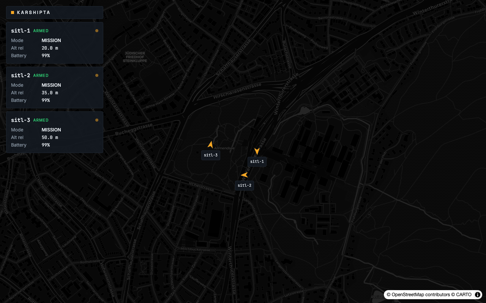

<p>
  
</p>

# Karshipta

**Open-source, self-hosted command and control for unmanned vehicle and tracker fleets. In your browser.**

[](https://github.com/NIKX-Tech/karshipta/actions/workflows/ci.yml)
[](https://www.gnu.org/licenses/agpl-3.0)
[](gateway/)
[](console/)
[](https://mavlink.io)
<br>
[](https://github.com/NIKX-Tech/karshipta)
[](https://github.com/NIKX-Tech/karshipta/stargazers)
[](.github/dependabot.yml)
[](https://karshipta.com)

<!--
Uncomment as they go live:
[](https://github.com/NIKX-Tech/karshipta/releases)
[](https://github.com/NIKX-Tech/karshipta/actions/workflows/codeql.yml)
[](https://securityscorecards.dev/projects/github.com/NIKX-Tech/karshipta)
[](https://github.com/sponsors/NIKX-Tech)
-->

Karshipta connects to real or simulated wards over MAVLink (PX4, ArduPilot) and gives you a live web console to monitor and task the whole fleet: map, telemetry, commands, missions. A ward is any tracked, controlled unit: a flight vehicle today, and any other MAVLink-speaking tracked entity (a livestock tag, a generic tracker) tomorrow. Self-hosted, no cloud dependency, one binary protobuf contract end to end.

> Named after Karshipta, the Avestan bird said to be the chief of all birds, the messenger that kept an isolated refuge connected to the outside world.



*The console flying three demo wards over the PX4 SITL home position.*

---

## Status

Early development, pre-release. The roadmap to v0.1 is in [ROADMAP.md](ROADMAP.md). Star the repo to follow the launch.

| Component | State |
|---|---|
| `proto/` protobuf contract | ✅ v1 schema defined |
| `console/` web dashboard | 🚧 live map, commands, missions, simulated fleet |
| `gateway/` MAVLink edge service | 🚧 connect, telemetry, commands done (M1 to M3); multi-ward and missions next (M4 to M6 in [gateway/BRIEF.md](gateway/BRIEF.md)) |
| `deploy/` one-command demo | ✅ SITL + gateway + console all wired up (M6, C6) |

## Try the console

```bash
git clone https://github.com/NIKX-Tech/karshipta
cd karshipta/console
npm install && npm run proto:gen
npm run dev -- --open
```

The console opens empty, on purpose: no auto-started fleet pretending to be
your hardware. Everything from there is one click:

- **Add demo ward**: instant, no setup, nothing to connect. Good for a
  first look.
- **Add simulated ward** or **Connect real ward**: both need a running
  gateway (the C++ service that speaks MAVLink); the console's connection
  panel (top bar) walks you to it, or see [docs/quickstart.md](docs/quickstart.md)
  to run one against PX4 SITL.

## The one-command demo

```bash
docker compose -f deploy/docker-compose.yml up
```

This starts three PX4 SITL wards, the gateway (serving over
`ws://localhost:8765`, the same port a natively run gateway uses), and the
console itself, built as a static site and served by nginx. Open
[http://localhost:5173](http://localhost:5173): `sitl-1` is live on the map
instead of the fake fleet, no extra setup.

## Architecture

```
 PX4 / ArduPilot wards (real or SITL)
        |  MAVLink
   [ gateway ]        C++20 + MAVSDK edge service
        |  protobuf Envelopes over WebSocket (E2E-encrypted relay optional)
   [ console ]        SvelteKit web dashboard
```

The protobuf schema in [`proto/karshipta/v1/`](proto/karshipta/v1/) is the contract everything is generated from: C++ types at gateway build time, TypeScript types via ts-proto. One binary Envelope per WebSocket frame, in both directions. See [docs/architecture.md](docs/architecture.md).

## Contributing

Contributions are welcome; the surface is kept deliberately small until the v0.1 launch. Read [CONTRIBUTING.md](CONTRIBUTING.md) for the branching model (`dev` for integration, `main` for releases), the ground rules, and local setup. All contributors sign the lightweight CLA in [CLA.md](CLA.md).

## Safety disclaimer

Karshipta is simulation-first software under active development. It is not certified for controlling real aircraft in operational settings. If you connect real hardware, you do so at your own risk, in compliance with your local aviation regulations, and with a safety pilot in control at all times.

## License

[AGPL-3.0](LICENSE). Commercial licensing and enterprise features: contact NIKX Technologies B.V. via [karshipta.com](https://karshipta.com).
