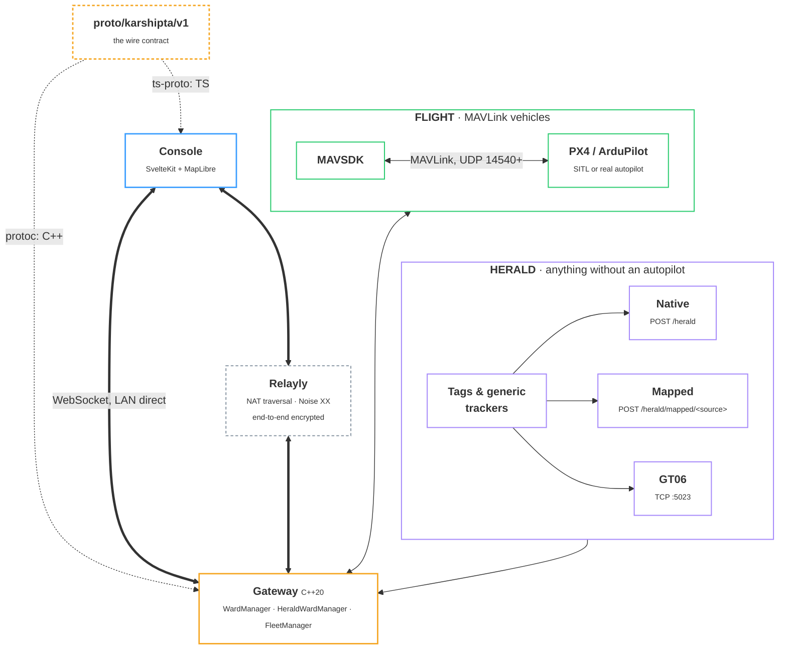

<p>
  
</p>

# Karshipta

**Open-source, self-hosted command and control for fleets of unmanned vehicles and trackers. In your browser.**

[](https://github.com/NIKX-Tech/karshipta/actions/workflows/ci.yml)
[](https://www.gnu.org/licenses/agpl-3.0)
[](gateway/)
[](console/)
[](https://mavlink.io)
<br>
[](https://github.com/NIKX-Tech/karshipta)
[](https://github.com/NIKX-Tech/karshipta/stargazers)
[](.github/dependabot.yml)
[](https://karshipta.com)

<!--
Uncomment as they go live:
[](https://github.com/NIKX-Tech/karshipta/releases)
[](https://github.com/NIKX-Tech/karshipta/actions/workflows/codeql.yml)
[](https://securityscorecards.dev/projects/github.com/NIKX-Tech/karshipta)
[](https://github.com/sponsors/NIKX-Tech)
-->

Karshipta connects to real or simulated wards over MAVLink (PX4, ArduPilot) and gives you a live web console to organize, monitor, and task the whole fleet: map, telemetry, commands, missions, geofenced zones. A ward is any tracked, controlled unit - flight (multirotor, fixed-wing, VTOL, helicopter), ground, underwater, surface vessel - plus trackers with no autopilot at all (livestock GPS tags, generic trackers), ingested over HTTP instead of MAVLink. Group wards into Fleets, draw keep-in/keep-out Zones, and dispatch a Fleet Mission where every ward flies its own independently-planned route, not one shared route broadcast to everyone. Self-hosted, no cloud dependency, one binary protobuf contract end to end.

> Named after Karshipta, the Avestan bird said to be the chief of all birds, the messenger that kept an isolated refuge connected to the outside world.


*The console flying three demo wards over the PX4 SITL home position.*

---

## Status

**v0.1.0 - first public release.** [ROADMAP.md](ROADMAP.md) covers what shipped and what's next.

| Component | State |
|---|---|
| `proto/` protobuf contract | `karshipta.v1` schema, the single source of truth for the wire format |
| `gateway/` MAVLink + Herald edge service | connectivity, telemetry, commands, missions, multi-ward, Fleet/Zone/Fleet-Mission persistence, Herald ingestion (native, vendor-mapped, GT06), relay transport, concurrency-hardened - M1 to M10 in [gateway/BRIEF.md](gateway/BRIEF.md) |
| `console/` web dashboard | map, commands, missions, Fleet and Zone management, per-ward Fleet Missions, airspace overlay, simulated fleet, published as an embeddable npm package - C1 to C8 in [ROADMAP.md](ROADMAP.md); a demo GIF and a fresh-eyes quickstart pass are still open ([#22](https://github.com/NIKX-Tech/karshipta/issues/22)/[#32](https://github.com/NIKX-Tech/karshipta/issues/32)), not blocking this release |
| `deploy/` one-command demo | SITL + gateway + console all wired up |
| Prebuilt gateway binaries | macOS (arm64), Linux, Windows, published to [GitHub Releases](https://github.com/NIKX-Tech/karshipta/releases) on each tagged release |

## Try the console

```bash
git clone https://github.com/NIKX-Tech/karshipta
cd karshipta/console
npm install && npm run proto:gen
npm run dev -- --open
```

The console opens empty, on purpose: no auto-started fleet pretending to be
your hardware. Everything from there is one click:

- **Add demo ward**: instant, no setup, nothing to connect. Good for a
  first look.
- **Add simulated ward** or **Connect real ward**: both need a running
  gateway (the C++ service that speaks MAVLink); the console's connection
  panel (top bar) walks you to it, or see [docs/quickstart.md](docs/quickstart.md)
  to run one against PX4 SITL.

## The one-command demo

```bash
docker compose -f deploy/docker-compose.yml up
```

This starts three PX4 SITL wards, the gateway (serving over
`ws://localhost:8765`, the same port a natively run gateway uses), and the
console itself, built as a static site and served by nginx. Open
[http://localhost:5173](http://localhost:5173): `sitl-1` is live on the map
instead of the fake fleet, no extra setup.

Optionally, turn on the airspace layer (docs/console-ux.md) with a free key
from [openaip.net](https://www.openaip.net/): put `PUBLIC_OPENAIP_KEY=<your
key>` in `deploy/.env` (Compose only auto-loads a `.env` file from the same
directory as the compose file passed to `-f`, not the directory you run the
command from). Without it the map works the same, just without that layer.

## Fleets, Zones, and Missions

A **Fleet** is a named, persistent group of wards - a ward can belong to
more than one. A **Zone** is a named keep-in or keep-out polygon, drawn on
the map, checked against mission waypoints before you dispatch. A **Fleet
Mission** assigns a route to a Fleet or an ad-hoc set of wards, but not the
same route to everyone: each ward gets its own independently-planned path,
tracked through upload, active flight, and stop, both per-ward and as one
aggregate status on its own card. Stopping one falls back to RTL by
default, with Hold-in-place or Land available per ward; removing or editing
a Fleet Mission is safety-gated until every ward it touched has actually
stopped. See [docs/fleet-mission-model.md](docs/fleet-mission-model.md) for
the full design and [docs/console-ux.md](docs/console-ux.md) for the
console layout.

## Building on Karshipta (SDK)

Two ways to build against Karshipta instead of just running the console
as-is: embed its own UI pieces via the published
`@nikx-tech/karshipta-console-core` npm package, or talk to the gateway
directly over its WebSocket wire protocol from any language that can decode
protobuf. See [docs/sdk.md](docs/sdk.md) for both.

## Architecture

One shared wire contract, one gateway process, and two ways in for a ward.



The protobuf schema in [`proto/karshipta/v1/`](proto/karshipta/v1/) is the contract everything is generated from: C++ types at gateway build time, TypeScript types via ts-proto. One binary `Envelope` per WebSocket frame, in both directions.

| Path | Protocol | Carries |
|---|---|---|
| MAVLink | MAVSDK over UDP, port 14540+ | Flight vehicles: PX4, ArduPilot, SITL or real |
| Herald, native | HTTP `POST /herald` | A payload that is already a Herald message |
| Herald, mapped | HTTP `POST /herald/mapped/<source>` | A vendor's own JSON, translated by a declarative YAML field mapping |
| Herald, GT06 | Raw TCP, port 5023 | Cheap GT06-family GPS trackers, hundreds of models |

MAVLink and Herald are two independent domains, not stages of one pipeline: `karshipta-gateway` links both, `karshipta-herald` links MAVSDK to neither and never sees a "MAVLink mode" toggle. See [gateway/docs/herald-ingest.md](gateway/docs/herald-ingest.md) for the full ingestion writeup.

> [!NOTE]
> **On the roadmap, not built yet:** a DJI-to-MAVLink bridge, a Cursor-on-Target bridge ([#105](https://github.com/NIKX-Tech/karshipta/issues/105)), an OGC SensorThings bridge ([#106](https://github.com/NIKX-Tech/karshipta/issues/106)), and org scoping for Herald's `org_id` field ([#104](https://github.com/NIKX-Tech/karshipta/issues/104)).

> [!TIP]
> **Distribution beyond this repo:** `karshipta-desktop` wraps this exact gateway binary as a signed Tauri sidecar, for customers running MAVLink hardware who would rather not touch a terminal. `karshipta-cloud` (private) is the hosted console and backend: org and billing, a persistent relay peer per site, a viewport-bounded public guest feed. Neither forks the gateway; both reach it over the same relay transport shown above.

See [docs/architecture.md](docs/architecture.md) for the full breakdown.

## Contributing

Contributions are welcome; the surface is kept deliberately small. Read [CONTRIBUTING.md](CONTRIBUTING.md) for the branching model (`dev` for integration, `main` for releases), the ground rules, and local setup. All contributors sign the lightweight CLA in [CLA.md](CLA.md).

## Safety disclaimer

Karshipta is simulation-first software under active development. It is not certified for controlling real aircraft in operational settings. If you connect real hardware, you do so at your own risk, in compliance with your local aviation regulations, and with a safety pilot in control at all times.

## License

[AGPL-3.0](LICENSE). Commercial licensing and enterprise features: contact NIKX Technologies B.V. via [karshipta.com](https://karshipta.com).
