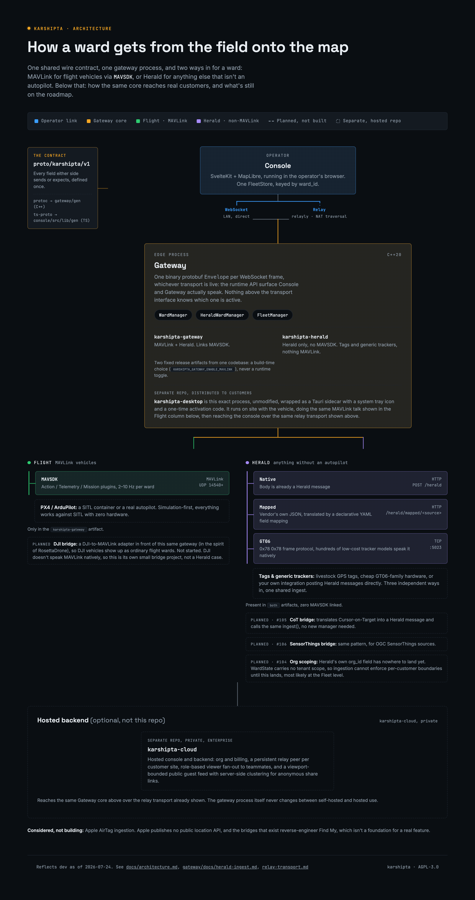

# Karshipta Architecture



*The proto contract both sides generate from, the gateway core and its two ingestion domains, how the same core reaches customers who would rather not run it themselves (dashed, separate repos), and what is still on the roadmap (dashed chips). Reflects `dev`; regenerate this diagram when the shape of the system actually changes, not on every commit.*

## Components

**proto/** The contract. Protobuf package `karshipta.v1`: GeoPoint and enums (common.proto), WardInfo/WardState/Event (telemetry.proto), Command/CommandAck/Mission/MissionProgress (command.proto), Fleet/Zone/FleetMissionAssignment (fleet.proto), and the wire Envelope (envelope.proto). Every WebSocket frame between gateway and console is exactly one binary-encoded Envelope. C++ types are generated by protoc at gateway build time; TypeScript types are generated with ts-proto into `console/src/lib/gen/`.

**gateway/** C++20 service built on MAVSDK. Discovers wards from a config file of MAVLink connection URLs, assigns stable ward_ids, publishes telemetry at 2 to 10 Hz per ward, executes commands and missions, emits events, and groups wards into Fleets with Zone geofencing (`FleetManager`, SQLite-backed). A ward is any MAVLink-speaking tracked entity, not just a flight vehicle; commands and missions only apply to wards that report a `flight` state. Transport is an interface: implementation 1 is a plain WebSocket server for local use; implementation 2 connects outward through an E2E-encrypted relay ([relayly](https://github.com/NIKX-Tech/relayly)) for remote operations. Reconnects forever on both the MAVLink and transport sides. Alongside MAVLink, the gateway also accepts [Herald](https://github.com/NIKX-Tech/herald) messages for tracked entities with no autopilot at all (a livestock tag, a generic GPS tracker) over three independent paths: a native HTTP endpoint, a declarative JSON field mapping for vendor payloads, and a raw TCP listener for the GT06 protocol hundreds of low-cost trackers speak. See `gateway/docs/herald-ingest.md`. MAVLink support is a build-time choice, not a runtime one: `karshipta-gateway` (MAVLink and Herald) and `karshipta-herald` (Herald only, no MAVSDK linked) are two fixed release artifacts from this one codebase.

**console/** SvelteKit + TypeScript strict web app. One transport module owns the WebSocket and reconnect logic; one FleetStore owns all state keyed by ward_id; components render from the store. MapLibre GL renders the fleet, clustering nearby wards at low zoom. Every command carries a uuid and is matched to its CommandAck; rejections are surfaced with reasons.

**deploy/** docker-compose that starts N PX4 SITL containers, the gateway, and the console. This is the demo and the default development environment.

## Data flow

```
SITL/ward --MAVLink/UDP--> gateway --Envelope/WS--> console
console --Command Envelope--> gateway --MAVSDK Action/Mission--> ward
```

## Design principles

- Schema first. The proto files change by PR before any code that needs new fields.
- Two languages: C++ at the edge, TypeScript everywhere else.
- No backend server and no database on the console side; the gateway persists its own state locally (YAML for ward configs, SQLite for Fleet/Zone) and talks to the console directly.
- Every failure observable: acks with reasons, events for link loss, connected flags in state.
- Simulation-first: everything must work against SITL with zero hardware.

## Distribution

This repo (AGPL-3.0) is the whole self-hosted product: build the gateway, build or run the console, point one at the other. Two other repos build on this same core without forking it, for customers who would rather not run it themselves:

- **karshipta-desktop** wraps a signed, unmodified `karshipta_gateway` binary as a Tauri sidecar: a system tray app with a one-time activation code, for non-technical customers running MAVLink hardware on their own site.
- **karshipta-cloud** (private) is the hosted console and backend: org and billing, a persistent relay peer per customer site, and a viewport-bounded public guest feed.

Neither changes what the gateway process itself does; both reach it over the same relay transport described above.

## Milestones

Gateway milestones M1 to M6 are specified in `gateway/BRIEF.md`. Console milestones mirror them: map + fake data, live telemetry, commands, multi-ward, mission editor, demo polish.
